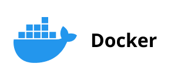

# Docker

```bash
----------Dockerfile: базовые инструкции------------
# Задать базовый образ для нового образа (от него наследуются все слои)
FROM node:22-alpine

# Задать метаданные образа (автор, версия, описание)
LABEL maintainer="you@example.com" version="1.0"

# Задать рабочую директорию для последующих RUN, CMD, COPY, ADD
WORKDIR /app

# Скопировать файлы из контекста сборки в образ
COPY package*.json ./

# Выполнить команду во время сборки образа (создаёт новый слой)
RUN npm install --production

# Задать переменную окружения, доступную при запуске контейнера
ENV NODE_ENV=production PORT=3000

# Объявить порт, который слушает контейнер (только документация)
EXPOSE 3000

# Задать пользователя для последующих инструкций и запуска контейнера
USER node

# Задать команду по умолчанию при запуске контейнера (можно переопределить)
CMD ["node", "app.js"]

# Задать точку входа — команду, которая всегда выполняется при запуске
ENTRYPOINT ["node"]

# Смонтировать том для данных (persistent data)
VOLUME ["/data"]

# Добавить проверку здоровья контейнера
HEALTHCHECK --interval=30s --timeout=3s CMD curl -f http://localhost:3000/health || exit 1

----------Dockerfile: инструкции для копирования------------
# Скопировать файлы из контекста сборки в образ (прозрачная альтернатива ADD)
COPY src/ ./src/

# Добавить файлы, каталоги или URL в образ (умеет распаковывать архивы)
ADD app.tar.gz /app/

# Скопировать файлы из предыдущей стадии сборки (multi-stage)
COPY --from=builder /app/dist ./dist

# Скопировать файл с изменением владельца
COPY --chown=node:node . .

----------Dockerfile: аргументы сборки------------
# Задать аргумент сборки, доступный только во время сборки
ARG VERSION=1.0

# Использовать аргумент в инструкции
RUN echo "Building version ${VERSION}"

# Преобразовать ARG в ENV для использования во время выполнения
ENV APP_VERSION=${VERSION}

----------Dockerfile: multi-stage сборка------------
# Стадия сборки (названа builder)
FROM golang:1.22 AS builder

# Скопировать исходники и собрать бинарник
COPY . .
RUN CGO_ENABLED=0 go build -o /app/app .

# Стадия выполнения (финальный минимальный образ)
FROM alpine:latest

# Скопировать только собранный бинарник из builder
COPY --from=builder /app/app /app/app

# Запустить приложение
CMD ["/app/app"]

----------Dockerfile: оптимизация------------
# Объединять команды в один RUN, чтобы уменьшить количество слоёв
RUN apt-get update && apt-get install -y --no-install-recommends curl \
    && rm -rf /var/lib/apt/lists/*

# Использовать кэш-монтирование для пакетных менеджеров (BuildKit)
RUN --mount=type=cache,target=/root/.npm npm install

# Копировать только файлы зависимостей первыми (для кэширования)
COPY package*.json ./
RUN npm install

# Затем копировать остальной код (изменения в коде не сбрасывают кэш зависимостей)
COPY . .

# Использовать минимальный базовый образ (alpine, slim, distroless)
FROM python:3.12-slim

----------.dockerignore: исключение файлов из контекста сборки------------
# Игнорировать папку .git (история коммитов не должна попасть в образ)
.git/

# Игнорировать файлы окружения с секретами
.env
.env.*

# Игнорировать приватные ключи и сертификаты
*.pem
*.key
*.cert
*.p12

# Игнорировать папку с зависимостями (Dockerfile установит их сам)
node_modules/

# Игнорировать артефакты сборки (будут пересобраны внутри образа)
dist/
build/
target/

# Игнорировать файлы IDE и редакторов
.vscode/
.idea/
*.iml
*.swp

# Игнорировать системный мусор
.DS_Store
Thumbs.db

# Игнорировать логи и временные файлы
*.log
*.tmp

# Игнорировать файлы Docker и CI (не нужны внутри образа)
Dockerfile*
docker-compose*.yml
.github/

# Не игнорировать файл .env.example (шаблон для разработчиков)
!.env.example

# Не игнорировать настройки VS Code, полезные в контейнере
!.vscode/settings.json

----------Команды Docker: образы------------
# Собрать образ из Dockerfile в текущей директории с тегом
docker build -t my-app:1.0 .

# Собрать с указанием конкретного Dockerfile
docker build -t my-app:1.0 -f Dockerfile.prod .

# Собрать с аргументом сборки
docker build --build-arg VERSION=1.2.3 -t my-app .

# Собрать без кэша
docker build --no-cache -t my-app .

# Собрать только до определённой стадии (multi-stage)
docker build --target builder -t my-app-builder .

# Список локальных образов
docker images

# Скачать образ из реестра
docker pull nginx:1.25-alpine

# Пометить образ для реестра
docker tag my-app:1.0 registry.example.com/my-app:1.0

# Загрузить образ в реестр
docker push registry.example.com/my-app:1.0

# Удалить образ
docker rmi nginx

# Удалить неиспользуемые образы
docker image prune -a

# Сохранить образ в tar-файл
docker save -o nginx.tar nginx:latest

# Загрузить образ из tar-файла
docker load -i nginx.tar

----------Команды Docker: контейнеры------------
# Запустить контейнер в фоне с пробросом порта
docker run -d -p 8080:80 --name web nginx

# Запустить интерактивный контейнер с оболочкой
docker run -it ubuntu bash

# Запустить с монтированием тома
docker run -d -v my-volume:/data nginx

# Запустить с переменными окружения
docker run -d -e NODE_ENV=production my-app

# Запустить с автоматическим удалением после остановки
docker run --rm alpine echo "hello"

# Список запущенных контейнеров
docker ps

# Список всех контейнеров (включая остановленные)
docker ps -a

# Остановить контейнер (SIGTERM, затем SIGKILL)
docker stop web

# Принудительно остановить контейнер (SIGKILL)
docker kill web

# Запустить остановленный контейнер
docker start web

# Перезапустить контейнер
docker restart web

# Удалить контейнер
docker rm web

# Удалить все остановленные контейнеры
docker container prune

# Выполнить команду в работающем контейнере
docker exec -it web bash

# Скопировать файл из контейнера на хост
docker cp web:/app/logs.txt ./logs.txt

# Скопировать файл с хоста в контейнер
docker cp ./config.json web:/app/config.json

# Просмотреть логи контейнера
docker logs web

# Просмотреть логи с отслеживанием
docker logs -f web

# Просмотреть последние 100 строк логов
docker logs --tail 100 web

# Просмотреть процессы внутри контейнера
docker top web

# Просмотреть потребление ресурсов
docker stats web

# Просмотреть метаданные контейнера
docker inspect web

----------Команды Docker: сети------------
# Список сетей
docker network ls

# Создать сеть
docker network create my-network

# Создать сеть с драйвером overlay (для Swarm)
docker network create --driver overlay my-overlay

# Создать сеть с подсетью
docker network create --subnet=172.20.0.0/16 my-network

# Подключить контейнер к сети
docker network connect my-network web

# Отключить контейнер от сети
docker network disconnect my-network web

# Удалить сеть
docker network rm my-network

# Удалить неиспользуемые сети
docker network prune

----------Команды Docker: тома------------
# Список томов
docker volume ls

# Создать том
docker volume create my-volume

# Просмотреть метаданные тома
docker volume inspect my-volume

# Удалить том
docker volume rm my-volume

# Удалить неиспользуемые тома
docker volume prune

----------Команды Docker: очистка------------
# Удалить все остановленные контейнеры, неиспользуемые сети, образы и кэш сборки
docker system prune

# То же, но с удалением неиспользуемых томов
docker system prune --volumes

# Показать использование диска Docker
docker system df

----------Docker Compose: управление------------
# Запустить все сервисы в фоне
docker-compose up -d

# Запустить конкретные сервисы
docker-compose up -d web db

# Пересобрать образы перед запуском
docker-compose up -d --build

# Остановить сервисы
docker-compose stop

# Остановить и удалить контейнеры и сети
docker-compose down

# Остановить и удалить всё, включая тома
docker-compose down -v

# Просмотреть логи всех сервисов
docker-compose logs

# Просмотреть логи конкретного сервиса
docker-compose logs -f web

# Список запущенных сервисов
docker-compose ps

# Выполнить команду в сервисе
docker-compose exec web bash

# Собрать образы без запуска
docker-compose build

# Скачать образы сервисов
docker-compose pull

# Проверить конфигурацию docker-compose.yml
docker-compose config
```